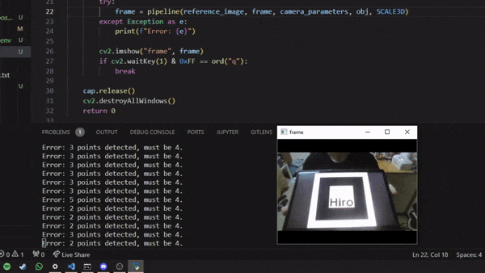

# Augmented Reality App

Marker-based and feature-based augmented reality app made with Python and OpenCV. 
- Marker-based: detects the marker by detecting the four rectangle corners, then renders the 3D model after applying homography.
- Feature-based: uses feature detection and matching to identify the marker.

# Requirements
- Python 3.8

# Known issues
- Docker doesn't have access to the webcam, so `main.py` doesn't work.
- Marker-based AR doesn't work well. A TODO is to implemented contour-based detection using the Douglas-Pucker algorithm.
  

# Problems and solutions

This sections documents the many problems I faced during development of this project, and the solutions I opted for.

1. Lines detected in the border -> extra intersections -> bigger problems.
   - This problem originated from the edge detection section of the pipeline, where the Canny algorithm was detecting the corner pixels of the image as edges. The surface that the marker was put on was also causing edges to show up.
   - Fix: parameter tuning of the Canny algorithm thresholds.

   

2. Overlapping detected intersections.
   - Some overlapping intersections were being returned, causing a lot of problems down the pipeline, since every intersection is considered when evaluating for rectangles.
   - Fix: apply a check for minimum threshold distance between intersections.

   
   

3. Polygons instead of rectangles.
   - When detecting rectangles, I was exhautively tracing every intersection and getting all possibilities. This was stored in a variable called `squares`, with each element being a list of 4 points (i.e., intersections). I couldn't figure out the proper conditions and restrictions to only return actual rectangles instead of all kinds of polygons. At first, it'd return around 5k squares, but with each iteration of new conditions and rules being added, it returned less: 4k, then 2k, then 1k, then 53, then 2, then 1, and currently none. The "best" one was with 53 squares, but after plotting them, I noticed that none of the 53 squares fit the marker properly (the big white square and the black square inside it). I basically had to start from scratch for this step of the pipeline.
   - Fix: scratched the rectangle identification. Now I use only the intersections for the marker corner and then apply homography.

   

4. Overlapping lines for rectangle identification
   - After getting the list of "squares" (more like polygons), I'd use its lines to check if they're what I want, i.e. the marker. Many of these would have lines overlapping or crossing eachother, which doesn't make sense for a rectangle. This problem could be related to Problem 3.
   - fix: scratched the rectangle identification. Now I use only the intersections for the marker corner and then apply homography.

   

5. Too many intersections (I only want 4: the corners of the marker)
   - I was frequently getting 16 or more intersections. It'd detect both square corners, but also erroneously detect intersections below the corners.
   - Fix: I increased the `min_intersection_distance` from 10 to 150. This works for the current image, but probably will cause problems in the video feed part, plus if the marker gets smaller in the source image. The previous value of 10 was used to fix overlapping intersections.

   
   

6. Homography sligthly wrong
   - The homography calculations were resulting in a slightly wrong position. It seemed like the scale was wrong.
   - Fix: adjusted the coordinates of the source (the 4 marker corners).

   
   

7. Intersection order affects homography
   - The order of the intersection points in `intersection` affects homography, since the points from the reference image are directly mapped to the intersections. In the real-time webcam version, this causes major issues as even if the marker is correctly detected, the model will flicker and warp all over the place due to the intersection order changing.
   - Fix: no clue, for now I've setup two distinct sets of `src_points` for the notebook images.

   
   

# Credits

Code adapted from https://github.com/mafda/augmented_reality_101

"Scrap Auto Turret [Low-poly]" (https://skfb.ly/oCRyJ) by fizikoldun is licensed under Creative Commons Attribution (http://creativecommons.org/licenses/by/4.0/).